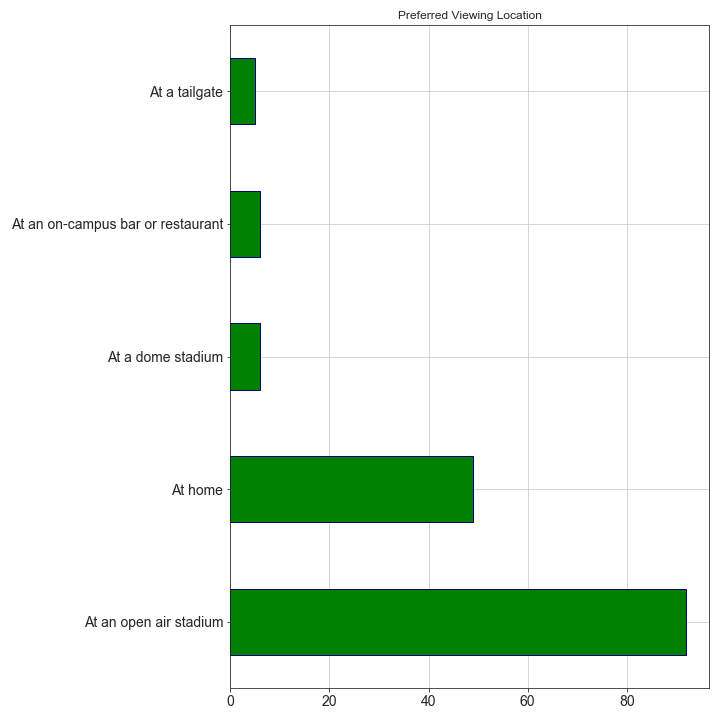

# College Football Attendance Survey

> "From 2014 to ’18, attendance across the FBS fell by 7.6%. Last year, on average, 41,856 fans went to games. That’s the 
> lowest turnout since 1996."
>
> Sports Illustrated

This survey and analysis is intended to help collegiate athletic directors determine college football fan expectations.

## Sample Size Demographics
I personally designed the survey using Google Forms and collected responses from both LinkedIn and Reddit.

## Findings

## Participant Comments
The most common comment from participants, that was not included on the survey, was that games are too long and there are too many timeouts.

## Progress
- [x] Create Survey
- [x] Data Collection
- [x] Data Cleaning
- [x] Data Analysis
- [x] Data Visualization
- [ ] Statistical Testing
