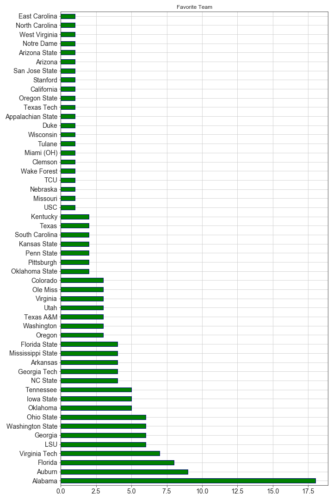

# College Football Attendance Survey
This survey and exploratory analysis is intended to help identify important factors college football fan consider when deciding if they will watch a game at home or attend in-person.

**Sports Illustrated (2020)**
> "From 2014 to ’18, attendance across the FBS fell by 7.6%. 
> Last year, on average, 41,856 fans went to games. 
> That’s the lowest turnout since 1996."

**CBS Sports (2020)**
> Attendance for the seven games run by the College Football Playoff dropped to an all-time low this postseason, 
> halfway through the CFP's initial contract that created the New Year's Six games and the CFP National Championship. 
> The attendance at those seven games were down a cumulative 42,500 fans or 8 percent from a playoff-era high in 2015.

## Sample Size Demographics
I personally designed the survey using Google Forms and collected responses from both LinkedIn and Reddit.

## Findings

## Additional Participant Comments
The most common comment from participants, that was not included on the survey, was that games are too long and there are too many timeouts.

## Progress
- [x] Create Survey
- [x] Data Collection
- [x] Data Cleaning
- [x] Data Analysis
- [x] Data Visualization
- [ ] Data Visulizations by Age Group
- [ ] Statistical Testing
