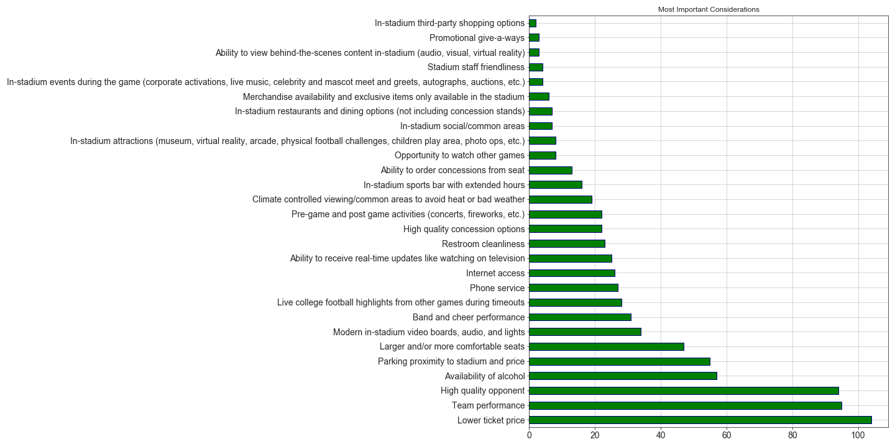

# College Football Attendance Survey

> "From 2014 to ’18, attendance across the FBS fell by 7.6%. Last year, on average, 41,856 fans went to games. That’s the 
> lowest turnout since 1996."
>
> Sports Illustrated

This survey and analysis is intended to help collegiate athletic directors determine what college football fans expectations.

## Sample Size Demographics
I personally designed the survey using Google Forms and collected responses from both LinkedIn and Reddit.

### Age

### Gender

### Favorite Team / Conference

## Findings

